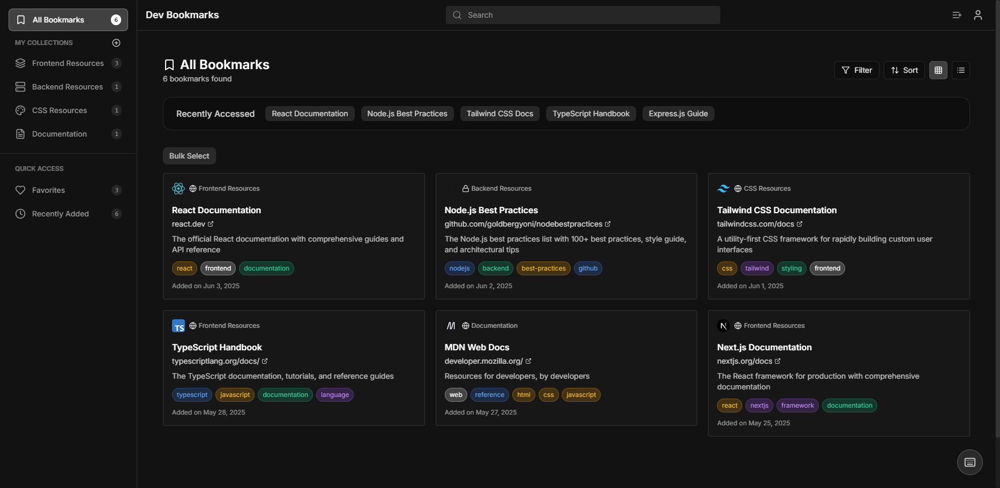

# Developer Bookmark Manager 🔖

<div align="center">
  
  <br/>
  <br/>
</div>

A comprehensive web application that assists developers in organizing, storing, and sharing valuable programming resources efficiently.

## 📸 Screenshots



## 🌟 Key Features

- **Bookmark Management**: Easily perform CRUD operations on both bookmarks and collections.
- **Smart Tagging**: Organize your bookmarks using intuitive custom tags.
- **Link Validation**: Automatic checking for dead links
- **Import/Export**: JSON format support for data portability
- **Search & Filter**: Find bookmarks by title, tags, or collection
- **Responsive UI**: Clean interface with dark mode support

## 🛠️ Tech Stack

### Backend
- **Java 17+** - Core programming language
- **Spring Boot 3.x** - Application framework
- **Spring Security with JWT** - Authentication & authorization
- **Spring Data JPA** - Data persistence layer
- **Microsoft SQL Server** - Database management system
- **Maven** - Build automation and dependency management

### Frontend
- **React 18+** - UI library for building user interfaces
- **TypeScript** - Type-safe JavaScript development
- **Tailwind CSS** - Utility-first CSS framework
- **Axios** - HTTP client for API requests
- **React Query** - Data fetching and caching library

## 🚀 Getting Started

### Prerequisites
- Java 17+ (OpenJDK recommended)
- Node.js 16+
- Microsoft SQL Server (Express or higher)
- Maven 3.8+

### Database Setup
1. Install SQL Server from [official website](https://www.microsoft.com/en-us/sql-server/sql-server-downloads)
2. Install SQL Server Management Studio (SSMS)
3. Create new database:
```sql
CREATE DATABASE BookmarkDB;
GO

-- Create login if not exists
CREATE LOGIN bookmark 
WITH PASSWORD = 'YourStrongPassword123';
GO

USE BookmarkDB;
GO

-- Create user
CREATE USER bookmark FOR LOGIN bookmark;
GO

-- Grant permissions
EXEC sp_addrolemember 'db_owner', 'bookmark';
GO
```

### Backend Setup

1. Clone the repository
```bash
git clone https://github.com/Naammmdz/developer-bookmark-manager.git
cd developer-bookmark-manager
```

2. Configure database connection
Edit `backend/src/main/resources/application.properties`:
```properties
# SQL Server Configuration
spring.datasource.url=jdbc:sqlserver://localhost:1433;databaseName=BookmarkDB;encrypt=true;trustServerCertificate=true
spring.datasource.username=sa
spring.datasource.password=YourStrongPassword123
spring.datasource.driverClassName=com.microsoft.sqlserver.jdbc.SQLServerDriver
spring.jpa.properties.hibernate.dialect=org.hibernate.dialect.SQLServerDialect
spring.jpa.hibernate.ddl-auto=validate
spring.jpa.show-sql=true
```

3. Run the backend server
```bash
cd backend
./mvnw clean install
./mvnw spring-boot:run
```
Backend will start at http://localhost:8080

### Frontend Setup

1. Navigate to frontend directory
```bash
cd frontend
```

2. Install dependencies
```bash
npm install
```

3. Start development server
```bash
npm run dev
```
Frontend will start at http://localhost:3000

## 📝 Project Structure

```
developer-bookmark-manager/
├── backend/                 # Spring Boot application
│   ├── src/
│   │   ├── main/
│   │   │   ├── java/      # Java source files
│   │   │   └── resources/ # Configuration files
│   │   └── test/          # Test files
│   └── pom.xml            # Maven configuration
├── frontend/               # React application
│   ├── src/
│   │   ├── components/    # React components
│   │   ├── services/      # API services
│   │   ├── hooks/         # Custom hooks
│   │   └── types/        # TypeScript types
│   ├── package.json
│   └── tsconfig.json
└── docs/                  # Project documentation
```

## 🔧 Development Tools Recommended

### Backend
- IntelliJ IDEA / Eclipse
- Postman for API testing
- SQL Server Management Studio (SSMS) for database management

### Frontend
- VS Code with extensions:
  - ESLint
  - Prettier
  - TypeScript
  - Tailwind CSS IntelliSense

## 📚 API Documentation

Once the backend is running, access Swagger UI at:
http://localhost:8080/swagger-ui.html

## 🧪 Testing

### Backend Tests
```bash
cd backend
./mvnw test
```

### Frontend Tests
```bash
cd frontend
npm test
```

## 🤝 Contributing

1. Fork the repository
2. Create your feature branch (`git checkout -b feature/amazing-feature`)
3. Commit your changes (`git commit -m 'Add amazing feature'`)
4. Push to the branch (`git push origin feature/amazing-feature`)
5. Open a Pull Request

## 🐛 Known Issues & Troubleshooting

### Backend
- If port 8080 is in use, modify `server.port` in `application.properties`
- For database connection issues, ensure MS SQL Server is running and accessible
- Check that the SQL Server is configured to allow SQL Server Authentication
- Verify firewall settings allow connections on port 1433

### Frontend
- If port 3000 is in use, Vite will automatically suggest another port
- For CORS issues, check backend configuration in `application.properties`
- Clear browser cache if experiencing unexpected behavior

## 👥 Team

- [@Naammmdz](https://github.com/Naammmdz) - Project Lead

## 📄 License

This project is licensed under the MIT License - see the [LICENSE](LICENSE) file for details.

---
Made with ❤️ by Team Developer Bookmark Manager
